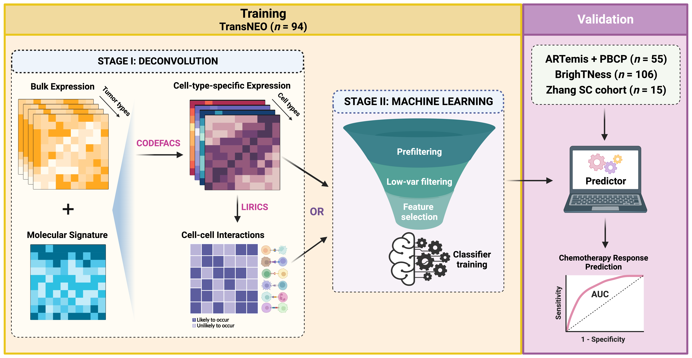

<div align="justify">

# DECODEM / DECODEMi: Systematic assessment of the roles of diverse cell types in tumor microenvironment in clinical response from bulk transcriptome  

<i>
**The relevant manuscript is currently under review:   

S. R. Dhruba, S. Sahni, B. Wang, D. Wu, Y. Schmidt, E. Shulman, S. Sinha, S. Sammut, C. Caldas, K. Wang, E. Ruppin. <b>"Predicting breast cancer patient response to neoadjuvant chemotherapy from the deconvolved tumor microenvironment transcriptome"</b>, 2023.  
</i>

We developed a novel computational framework called **DECODEM** (<ins>DE</ins>coupling <ins>C</ins>ell-type-specific <ins>O</ins>utcomes using <ins>DE</ins>convolution and <ins>M</ins>achine learning) that can systematically assess the roles of the diverse cell types in the tumor microenvironment (TME) in a given phenotype from bulk transcriptomics. In this work, we investigate the association of diverse cell types in breast cancer TME (BC-TME) to patient response to neoadjuvant chemotherapy (responder vs. non-responder). The framework is divided into two steps:  

1. **Deconvolution**: we use [CODEFACS](https://github.com/ruppinlab/CODEFACS/) to deconvolve the bulk gene expression into nine cell-type-specific gene expression profiles encompassing malignant, immune, and stromal cell types.  
2. **Machine Learning**: we use a **machine learning (ML) pipeline** to build nine cell-type-specific predictors of chemotherapy response using the deconvolved expression profiles.    

The output of the framework is the predictive power of each cell type (in terms of AUC and AP) which we use to assess the improvement over the bulk mixture and ***rank*** cell types in BC-TME. We further validate these top cell types in multiple **independent** BC cohorts encompassing both bulk and single-cell (SC) transcriptomics.  
<sub>
AUC = Area under the receiver operating characteristics curve  
AP = Average precision, equivalent to the area under the precision-recall curve  
</sub>  

  
<div align="center"><sup><i>
Figure: The full analysis pipeline for DECODEM and DECODEMi
</i></sup>  

<br></br>
Furthermore, we investigate the interactions between different cell types in two ways:  
* <b><i>Multi-cell-ensemble</i></b>: we incorporate the expression profiles of the top predictive cell types to boost the predictive power even further, yielding the best performance for an <b>ensemble of immune and stromal cell types</b> across two independent cohorts.  
* <b><i>DECODEMi</i></b>: we extended DECODEM to **DECODEMi** ('i' stands for interaction) where we use the <b>inferred cell-cell interactions (CCIs)</b> to identify the cellular communications that influence chemotherapy response.  

Our findings in breast cancer highlight the considerable predictive powers of the immune and stromal cells in the TME as well as denote key CCIs that are strongly predictive of chemotherapy response.  
</div></br>


## Dependencies  
The deconvolution stage was performed on HPC environment using `R` and `Rslurm` (as part of CODEFACS). The CCI inference were performed by using [LIRICS](https://github.com/ruppinlab/CODEFACS/) on the deconvolved data using `R`.  
The ML predictors were developed on MacOS using `python` and further tested on linux (on HPC). The ML scripts can be run interactively using a `python` IDE or on command line as `python <i>script_name</i>`. Complementary analyses including data preprocessing, enrichment analysis, CCI validation in SC, and plot generation were performed locally using `R` on RStudio.  

For `python` scripts:  
```python
python >= 3.8  
numpy >= 1.23   
pandas >= 1.4  
scikit-learn >= 1.1  
xgboost 1.6.1
pickle >= 3.0  
matplotlib >= 3.7
seaborn >= 0.12
tqdm >= 4.63  
lifelines >= 0.27  
pickle 4.0  
```  
  
For `R` scripts:  
```R
R >= 3.6  
tidyverse >= 1.3  
plyr >= 1.8
rtracklayer >= 1.57  
GenomicFeatures >= 1.50
clusterProfiler >= 4.6  
biomaRt >= 2.54  
msigdbr >= 7.5  
GSVA >= 1.45  
PRROC >= 1.3  
rstatix >= 0.7  
ggpubr >= 0.6  
glue >= 1.6  
```


## Reproducing the results
All the results presented in the above manuscript can be reproduced by using the scripts in [analysis/machine_learning](analysis/machine_learning/). This assumes that the bulk expression datasets have already been deconvolved and put in the designated directories within [data](data/).  
- The deconvolution was achieved by using the `slurm` scripts in [analysis/deconvolution/job_scripts](analysis/deconvolution/job_scripts/).  
- The scripts for the current version of [CODEFACS and LIRICS](https://github.com/ruppinlab/CODEFACS/) should be put in [analysis/deconvolution/CODEFACS](analysis/deconvolution/CODEFACS/) and [analysis/deconvolution/LIRICS](analysis/deconvolution/LIRICS/).  
- The `slurm` scripts were run on the NIH HPC system, [Biowulf](https://hpc.nih.gov/).   


### Data preprocessing  
All datasets should be deposited in [data](data/) using the structure outlined. To process data into the desired formats, use the scripts in [analysis/preprocessing](analysis/preprocessing/).  
Examples of some processed datasets are provided in [data/TransNEO](data/TransNEO/) and [data/BrighTNess](data/BrighTNess/). 


### DECODEM  
- To perform the cross-validation analysis using the TransNEO cohort, use the script: `model_transneo_cv_v1.py`  
- To train the cell-type-specific / multi-cell-ensemble predictors using TransNEO and validate on the ARTemis + PBCP cohort, use the script: `predict_sammut_validation_v2.py`  
- To train the cell-type-specific / multi-cell-ensemble predictors using TransNEO and validate on the BrighTNess cohort, use the script: `predict_brightness_validation_v2.py`  
- To train the cell-type-specific predictors using TransNEO and validate on the Zhang et al. single-cell cohort, use the script: `predict_tnbc_sc_validation_v2.py`  
- To train the cell-type-specific predictors using TransNEO and stratify survival on the TCGA-BRCA cohort, use the script: `stratify_tcga_validation_v3.py` 

If `svdat = True` in the scripts, the predictions will be saved in [data/TransNEO/transneo_analysis/mdl_data](data/TransNEO/transneo_analysis/mdl_data/).  


#### DECODEMi  
- To perform the cross-validation analysis using the TransNEO cohort and extract the top predictive CCIs, use the script: `model_transneo_lirics_cv_v3.py`  
- To train the CCI-based predictors using TransNEO and validate on the ARTemis + PBCP cohort, use the script: `predict_sammut_lirics_validation_v2.py`  
- To train the CCI-based predictors using TransNEO and validate on the BrighTNess cohort, use the script: `predict_brightness_lirics_validation_v2.py`  
- To computationally validate the top CCIs for prediction in TNBC that were extracted from DECODEMi using the single-cell pseudopatient cohort generated from the Zhang et al. SC-TNBC cohort (generates Figs. S4E-F),  use the script: `predict_sc_validation_cci_pseudopatients_v1.R`  

If `svdat = True` in the scripts, the predictions will be saved in [data/TransNEO/transneo_analysis/mdl_data](data/TransNEO/transneo_analysis/mdl_data/).  


### Enrichment & other analyses  
The enrichment analyses results and the figures/panels in the manuscript can be reproduced using the codes in [analysis/enrichment_and_figures](analysis/enrichment_and_figure/).  
- To perform the cell-type-specific GSEA analysis (generates *Fig. 3E*), use the script: `run_enrichment_top_cell_types_v3.R`
- To perform the GSVA analysis for CD4<sup>+</sup> / CD8<sup>+</sup> T-cells and estimate their predictive power (generates *Supp. Figs. 3A-D*), use the script: `enrichment_cd4_cd8_tcells_v2.R`   
- To perform the association analysis between cell-type-abundance and chemotherapy response (generates *Supp. Figs. 3E-G*), use the script: `get_abundance_response_corr_v2.py`  

If `svdat = True` in the scripts, the figure panels will be saved in [data/plots](data/plots/).  


### Reproducing the figures  
Fig. 1 was generated using [Biorender](http://biorender.com/). To reproduce the remaining figures, use the following scripts in [analysis/enrichment_and_figures](analysis/enrichment_and_figures/):  
- Figs. 2, 3A-D, Supp. Figs. 1-2: `generate_plots_ctp_v2.py`  
- Fig. 4, Supp. Figs. 4A-D: `generate_plots_cci_v2.py`  
- Fig. 5, Supp. Fig. 5: `generate_plots_sc_surv_v2.py`  

if `svdat = True` in the scripts, the figures will be saved in [data/plots](data/plots/) (the directory will be created if it doesn't exist already).  
Examples of the figures generated are provided in [figures](figures/).  
  
  
#### Contact: 
Saugato Rahman Dhruba (saugatorahman.dhruba@nih.gov)  
Cancer Data Science Lab, National Cancer Institute, National Institutes of Health  

</div>
