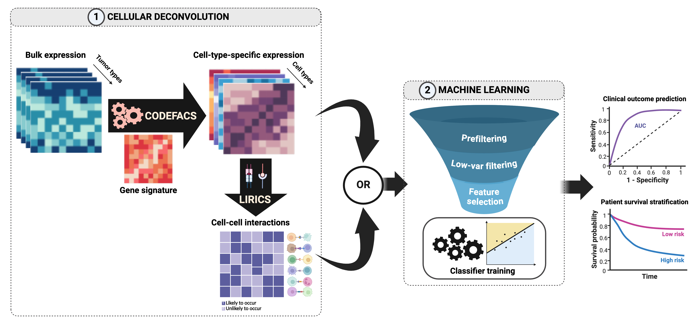

<div align="justify">

# DECODEM / DECODEMi: Systematic assessment of the tumor microenvironment from bulk transcriptome  


The relevant manuscript is now out at Cancer Letters:  
**[S. R. Dhruba, S. Sahni, B. Wang, D. Wu, P. S. Rajagopal, Y. Schmidt, E. Shulman, S. Sinha, S. Sammut, C. Caldas, K. Wang, E. Ruppin. <b>"Enhanced prediction of breast cancer patient response to chemotherapy by integrating deconvolved expression patterns of immune, stromal and tumor cells"</b>, Cancer Letters, 2025.](https://doi.org/10.1016/j.canlet.2025.218101)**

We developed a novel computational framework called **DECODEM** (<ins>DE</ins>coupling <ins>C</ins>ell-type-specific <ins>O</ins>utcomes using <ins>DE</ins>convolution and <ins>M</ins>achine learning) that can systematically assess the roles of the diverse cell types in the tumor microenvironment (TME) in a given phenotype from bulk transcriptomics. In this work, we investigate the association of the cell types in breast cancer TME (BC-TME) to patient response to neoadjuvant chemotherapy (responder vs. non-responder). The framework is divided into two steps:  

1. **Deconvolution**: we use [CODEFACS](https://doi.org/10.5281/zenodo.5790343) to deconvolve the bulk gene expression into nine cell-type-specific gene expression profiles encompassing malignant, immune, and stromal cell types.  
2. **Machine Learning**: we use a [**machine learning (ML) pipeline**](analysis/machine_learning/) to build nine cell-type-specific predictors of chemotherapy response using the deconvolved expression profiles.    

The output of the framework is the likelihood scores that the patients will respond to chemotherapy. We then **rank** the cell types within the BC-TME based on their predictive power (in terms of AUC, AP and DOR), identifying "prominent" cell types that provide improvements over the bulk mixture. We further validate the prominent cell types in multiple **independent** BC cohorts encompassing both bulk and single-cell (SC) transcriptomics.  
<sub>
AUC = Area under the receiver operating characteristics curve, 
AP  = Average precision, equivalent to the area under the precision-recall curve, 
DOR = Diagnostic odds ratio  
</sub>  

  
<p align="center"><sup><i>
Figure: The full analysis pipeline for DECODEM and DECODEMi
</i></sup></p>  

  
Furthermore, we investigate the interactions between different cell types in two ways:  
* <b><i>Multi-cell-ensemble</i></b>: we incorporate the expression profiles of the top predictive cell types to boost the predictive power even further, yielding the best performance for an <b>ensemble of immune and stromal cell types</b> across two independent cohorts.  
* <b><i>DECODEMi</i></b>: we extended DECODEM to **DECODEMi** ('i' stands for interaction) where we use the <b>inferred cell-cell interactions (CCIs)</b> (by using [LIRICS](https://doi.org/10.5281/zenodo.5790343)) to identify the cellular communications that influence chemotherapy response in BC.  

Our findings in breast cancer highlight the considerable predictive powers of the immune and stromal cells in the TME as well as denote key CCIs that are strongly predictive of chemotherapy response.  


## Dependencies  
The deconvolution stage was performed on HPC environment using `R` and `Rslurm` (as part of CODEFACS). The CCI inference was performed by using LIRICS on the deconvolved data and [CellChat v2](https://github.com/sqjin/CellChat) on SC data using `R`.  

The ML predictors were developed on MacOS using `python` and further tested on linux (on HPC). The ML scripts can be run interactively using a `python` IDE or on command line as `python script_name.py`. Complementary analyses *i.e.*, data preprocessing, enrichment analysis, CCI validation in SC and plot generation were performed locally using `R` on RStudio.  

Dependencies for `python` scripts:  
```python
python >= 3.10  
numpy >= 1.23   
pandas >= 1.4  
scikit-learn >= 1.1  
xgboost >= 1.6.1
pickle >= 3.0  
matplotlib >= 3.7
seaborn >= 0.12
tqdm >= 4.63  
lifelines >= 0.27  
pickle == 4.0  
```  
  
Dependencies for `R` scripts:  
```R
R >= 3.6  
tidyverse >= 1.3  
plyr >= 1.8
rtracklayer >= 1.57  
GenomicFeatures >= 1.50
clusterProfiler >= 4.6  
biomaRt >= 2.54  
msigdbr >= 7.5  
GSVA >= 1.45  
PRROC >= 1.3  
rstatix >= 0.7  
ggpubr >= 0.6 
seurat >= 5.1.0 
glue >= 1.6  
Matrix >= 1.6  
```


## Reproducing the results
All the results presented in the above manuscript can be reproduced by using the scripts provided in [analysis](analysis/). The assumption is that the different bulk expression datasets have already been deconvolved and put in the designated directories within [data](data/).  


### Running deconvolution with [CODEFACS and LIRICS](https://github.com/ruppinlab/CODEFACS/)  
The scripts for CODEFACS and LIRICS should respectively be put in [analysis/deconvolution/CODEFACS](analysis/deconvolution/CODEFACS/) and [analysis/deconvolution/LIRICS](analysis/deconvolution/LIRICS/). The cell type signature should be in [data/celltype_signature](data/celltype_signature/).  

- Deconvolution using CODEFACS was run by using the `slurm` scripts in [analysis/deconvolution/job_scripts](analysis/deconvolution/job_scripts/).  
- The `slurm` scripts were run on the NIH HPC system, [Biowulf](https://hpc.nih.gov/).  
- CCI inference using LIRICS was run by using the scripts in [analysis/deconvolution/LIRICS](analysis/deconvolution/LIRICS/).  


### Data preprocessing  
All datasets should be deposited in [data](data/) using the structure outlined. To process the deconvolved data into the desired formats, use the scripts in [analysis/preprocessing](analysis/preprocessing/).  

Examples of some processed datasets are provided in [data/TransNEO](data/TransNEO/) and [data/BrighTNess](data/BrighTNess/). 


### DECODEM: Cell-type-specific prediction  
- `model_transneo_cv_vX.py`: performs the cross-validation analysis using the TransNEO cohort.  
- `predict_sammut_validation_vX.py`: trains the cell-type-specific/multi-cell-ensemble predictors using TransNEO and validates on the ARTemis + PBCP cohort.  
- `predict_brightness_validation_vX.py`: trains the cell-type-specific/multi-cell-ensemble predictors using TransNEO and validates on the BrighTNess cohort containing triple negative breast cancer (TNBC) patients.  
- `predict_zhang_sc_validation_vX.py`: trains the cell-type-specific predictors using TransNEO and validates on the Zhang et al. single-cell cohort of TNBC patients (SC-TNBC).  
- `predict_bassez_sc_validation_vX.py`: trains the cell-type-specific predictors using TransNEO and validates on the Bassez et al. single-cell cohort of TNBC patients.
- `stratify_tcga_validation_vX.py`: trains the cell-type-specific predictors using TransNEO and stratifies survival on the TCGA-BRCA cohort. 
- _files with `_loo` in their name_ : performs hyperparameter tuning using a leave-one-out cross-validation.  

If `svdat = True` in the scripts, the predictions will be saved in [data/TransNEO/transneo_analysis/mdl_data](data/TransNEO/transneo_analysis/mdl_data/) (in .pkl format).  


### DECODEMi: CCI-based prediction  
- `model_transneo_lirics_cv_vX.py`: performs the cross-validation analysis using TransNEO and extracts the corresponding top predictive CCIs.  
- `predict_sammut_lirics_validation_vX.py`: trains the CCI-based predictor using TransNEO, validates on ARTemis + PBCP and extracts the corresponding top predictive CCIs.  
- `predict_brightness_lirics_validation_vX.py`: trains the CCI-based predictor using TransNEO, validates on BrighTNess and extracts the corresponding top predictive CCIs.  
- `predict_zhang_lirics_sc_validation_cellchat_vX.R`: validates the top predictive CCIs in TNBC (using BrighTNess) extracted by DECODEMi with Zhang et al. SC cohort (CCIs extracted by CellChat v2) and generates Figs. S4G-H.  

If `svdat = True` in the scripts, the predictions will be saved in [data/TransNEO/transneo_analysis/mdl_data](data/TransNEO/transneo_analysis/mdl_data/) (in .pkl format).  


### Enrichment & association analyses  
The enrichment analyses results and the figures (or panels) in the manuscript can be reproduced using the scripts in [analysis/enrichment_and_figures](analysis/enrichment_and_figure/).  

- `run_enrichment_top_cell_types_vX.R`: performs cell-type-specific GSEA analysis and generates Fig. 3G.
- `enrichment_cd4_cd8_tcells_vX.R`: performs GSVA analysis for CD4<sup>+</sup>/CD8<sup>+</sup> T-cells, estimates their predictive power and generates Supp. Figs. 6G-J.   
- `get_abundance_response_corr_vX.py`: performs an association analysis between cell type abundance and chemotherapy response, and generates Supp. Fig. 5.  

If `svdat = True` in the scripts, the figure panels will be saved in [data/plots](data/plots/) (in .pdf format).  


### Reproducing the figures  
[Fig. 1D](figures/Fig1_dataset_and_methodology_v2.pdf) was generated using Biorender ([Dhruba, S. R. (2025)](https://BioRender.com/z38y774)). To reproduce the remaining figures, use the following scripts in [analysis/enrichment_and_figures](analysis/enrichment_and_figures/):  

- `generate_plots_ctp_vX.py`: generates Figs. 1A-B, 2, 3A-F, Supp. Fig. 2-3.  
- `generate_plots_cci_vX.py`: generates Figs. 4A-F, Supp. Figs. 8A-D. 
- `generate_plots_sc_surv_vX.py`: generates Figs. 1C, 5, Supp. Figs. 10-11. 
- `explore_drug_by_icd_vX.py`: generates Supp. Fig. 7. 
- `make_benchmark_figures_vX.R`: generates Supp. Fig. 1. 

if `svdat = True` in the scripts, the figures will be saved in [data/plots](data/plots/) (in .pdf format).  

The figures were further polished using Adobe Illustrator. The final figures generated are provided in [figures](figures/).  
  
  
### Contact: 
Saugato Rahman Dhruba (dhruba018@gmail.com)  
Cancer Data Science Lab, NCI, NIH  

</div>
